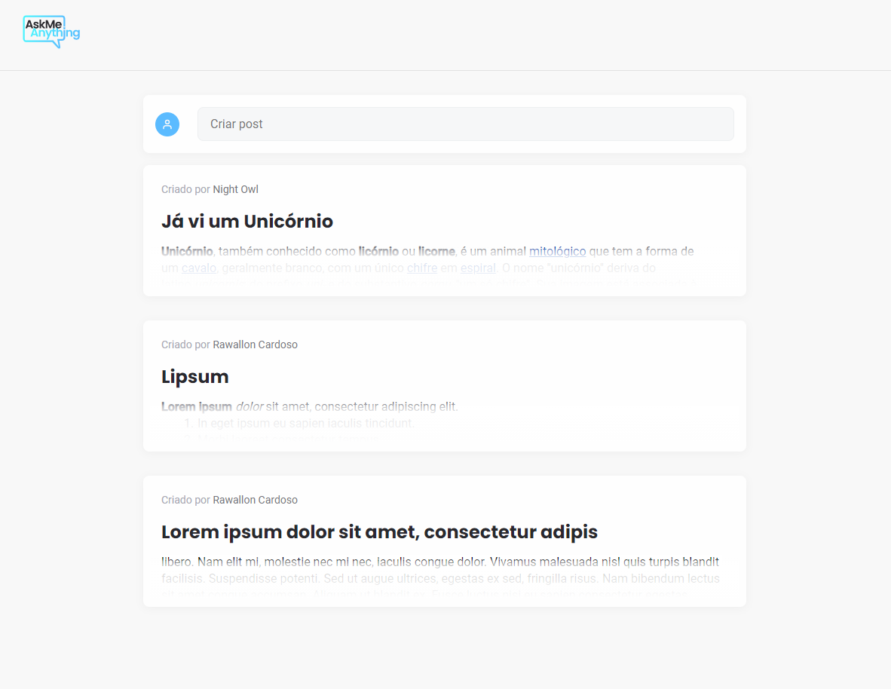
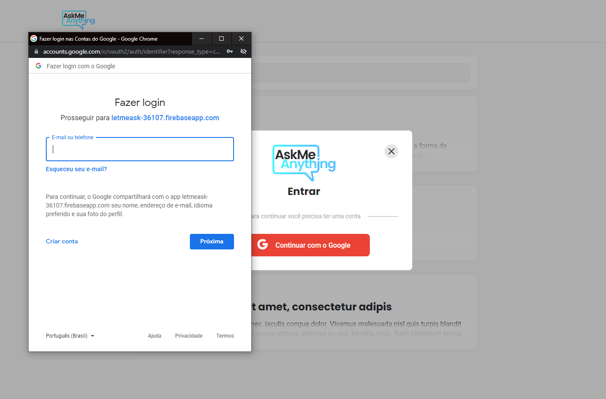
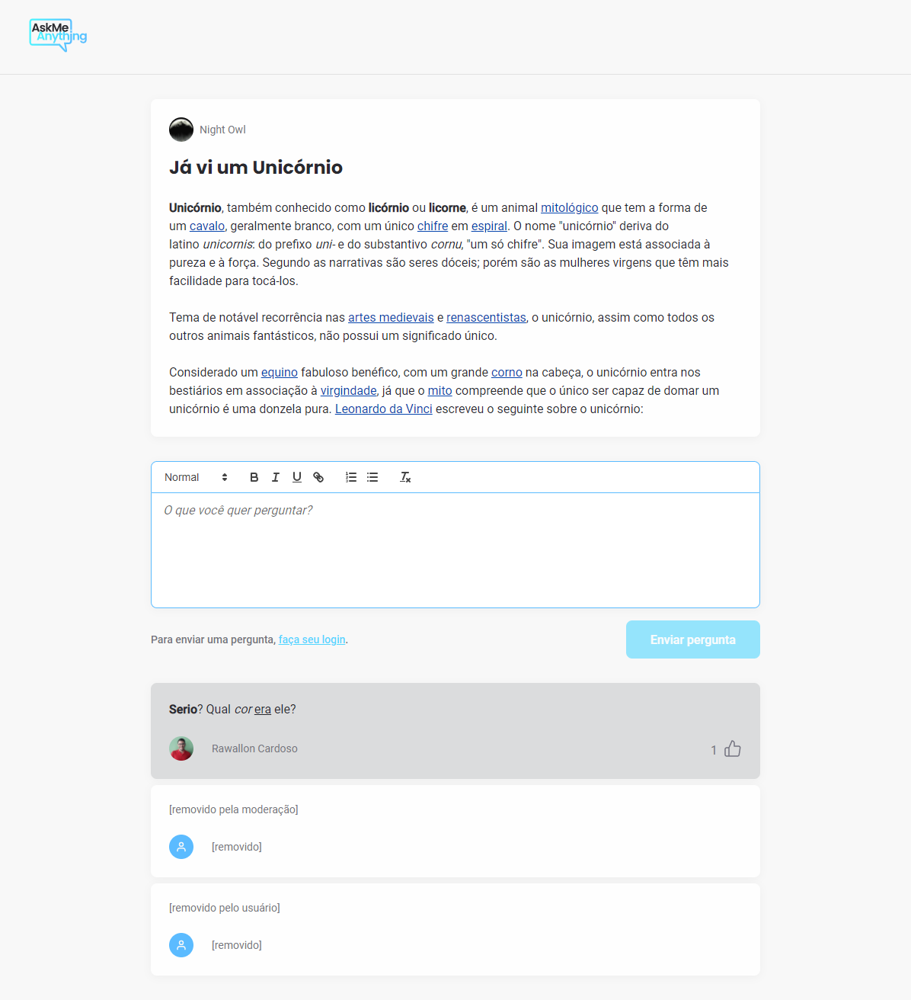
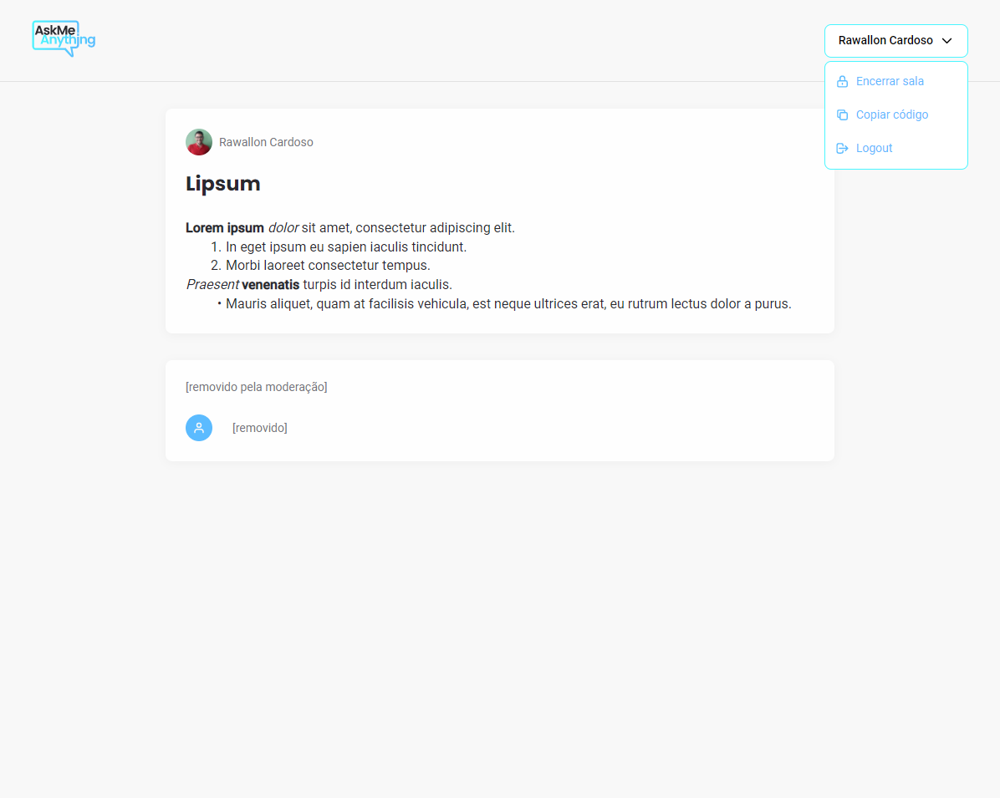
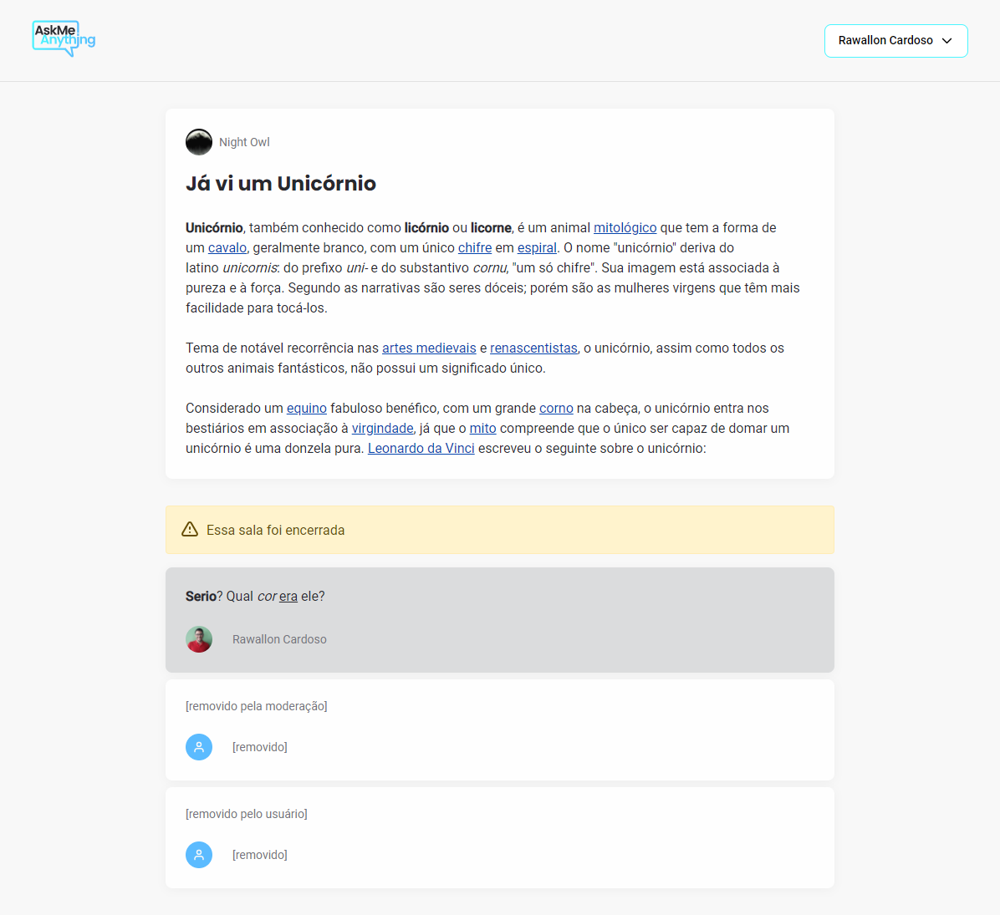

<div align="center">
  
</div>
<br/>
<h1 align="center">Ask Me Anything</h1>
<h5 align="center">YOUR platform for Q&A.</h5><br/>

## 🎯 About

Ask Me Anything is a platform built to let you gather questions from your viewers during your stream and let them vote for which are the best questions for you to answer.<br/>
Ask me Anything started out in Rocketseat's NLW Together Bootcamp, but since I liked the idea for an Q&A platform I took as a challange to redesign it and its functionalities<br/><br/>
Go try it and please let me know if you enjoyed it with a ⭐️, I would appreciate it a lot.
<br/>

## ▶️ Demo

Here you can find the demo link:

<a title="Deployed with Firebase" href="https://letmeask-36107.web.app/">

</a>

## :sparkles: Features

:heavy_check_mark: &nbsp;&nbsp;User Sign In/Sign out<br />
:heavy_check_mark: &nbsp;&nbsp;Auth through Firebase<br />
:heavy_check_mark: &nbsp;&nbsp;Create room with title/description<br />
:heavy_check_mark: &nbsp;&nbsp;Users can ask questions and like other users questions<br />
:heavy_check_mark: &nbsp;&nbsp;Room creator can highlight/answer questions <br />
:heavy_check_mark: &nbsp;&nbsp;Use of React hooks and custom hooks<br />
:heavy_check_mark: &nbsp;&nbsp;Responsive layout<br />
:heavy_check_mark: &nbsp;&nbsp;Loading skeleton<br />


## :rocket: Technologies

- [ReactJS](https://reactjs.org/)
- [Typescript](https://www.typescriptlang.org/)
- [Styled Components](https://www.styled-components.com/)
- [Quilljs](https://www.quilljs.com/)
- [Firebase Authentication](https://firebase.google.com/products/auth)
- [Firebase Realtime Database](https://firebase.google.com/products/realtime-database)
- [Firebase Hosting](https://firebase.google.com/products/hosting) and [Vercel](https://vercel.com/) for the deploy and CI.

### Deploy configuration steps

1. Connect your GitHub account
2. Select the project
3. In Settings → Environment Variables → Set **Environment variables** (ie: Firebase configuration).
   <br/>

## 📸 Screenshots
	
**Homepage**

<br/>

**Sign In / Sign Up**

<br/>

**Room**

<br/>

**Owner options**

<br/>

**Closed Room**

<br/>

<br/>


## 👨🏻‍💻 Run Locally

### :white_check_mark: Requirements

Before starting :checkered_flag:, you need to have [Git](https://git-scm.com) and [Node](https://nodejs.org/en/) installed.
<br/>

```bash

# Clone and access the folder
$ git clone https://github.com/rawallon/ask-me-anything.git && cd ask-me-anything

# Install the dependencies
$ npm install

# Configure your .env.local following the .env.exemple

# Run the web server
$ npm start
```