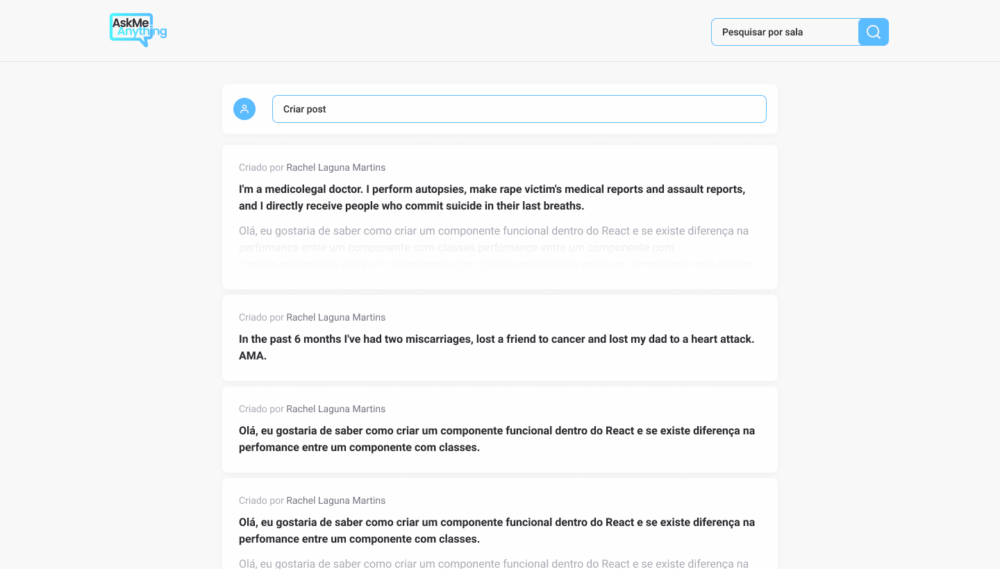

<div align="center">
  
</div>

## Ask Me Anything
<h4 align="center">
  Ask Me Anything is a platform built to let you gather questions from your viewers during your stream and let them vote for which are the best questions for you to answer.
</h4>

# Live Demo

<a title="Deployed with vercel" href="https://ask-me-anything.vercel.app/">

</a>


## Preview


## Tecnologies

This project was developed using cutting edge front-end technologies.


- [ReactJS](https://reactjs.org/)
- [Typescript](https://www.typescriptlang.org/)
- [Styled Components](https://www.styled-components.com/)
- [Quilljs](https://www.quilljs.com/)
- [Firebase Authentication](https://firebase.google.com/products/auth)
- [Firebase Realtime Database](https://firebase.google.com/products/realtime-database)

## How to run 

- You need to install [Node.js](https://nodejs.org/en/download/)  to run this project.

```bash

# Clone and access the folder
$ git clone https://github.com/rawallon/ask-me-anything.git && cd ask-me-anything

# Install the dependencies
$ npm install

# Remember to configure your .env.local following the .env.exemple

# Run the web server
$ npm start
```

The app will be available for access on your browser at `http://localhost:3000`

## 📝 License

This project is licensed under the MIT License - see the [LICENSE](LICENSE) file for details.

---
